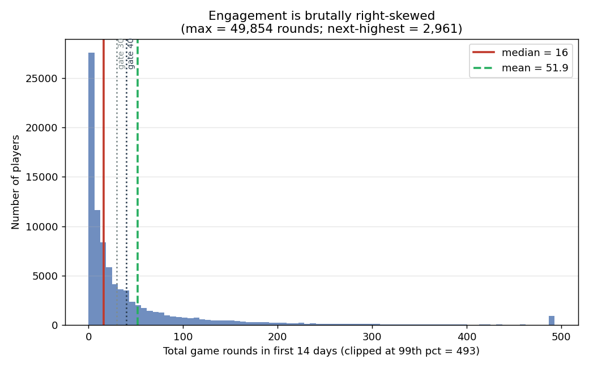
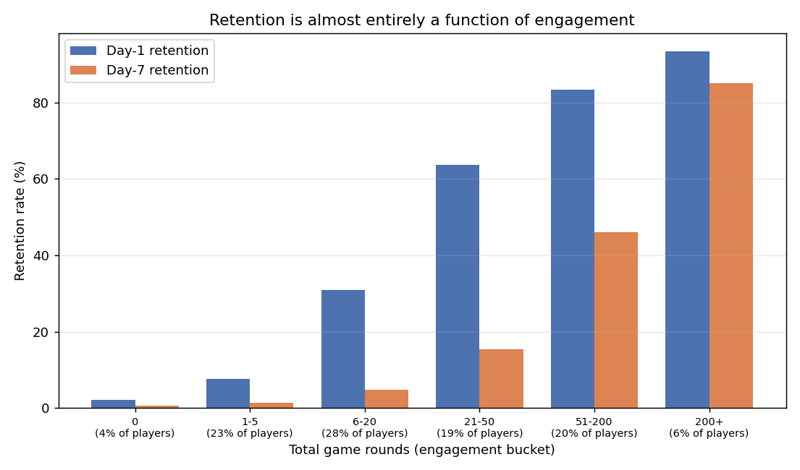
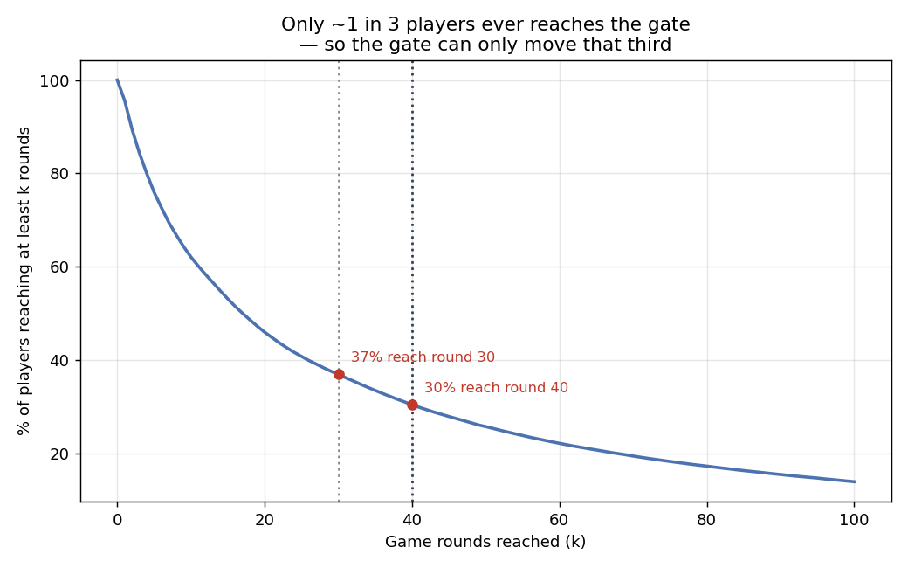
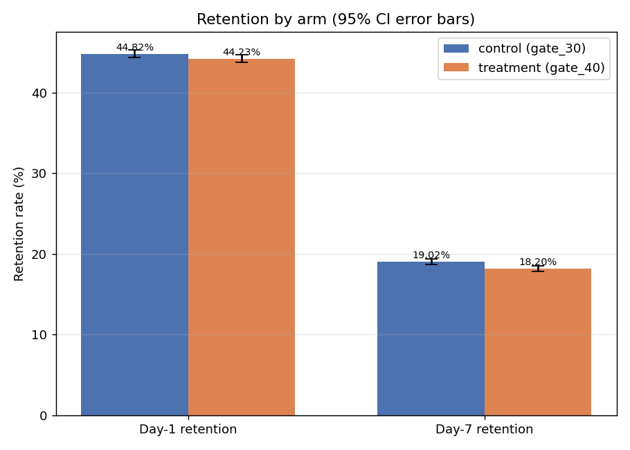
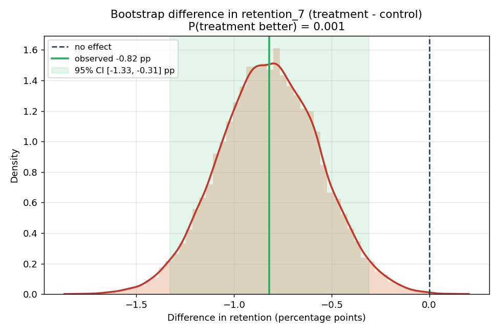
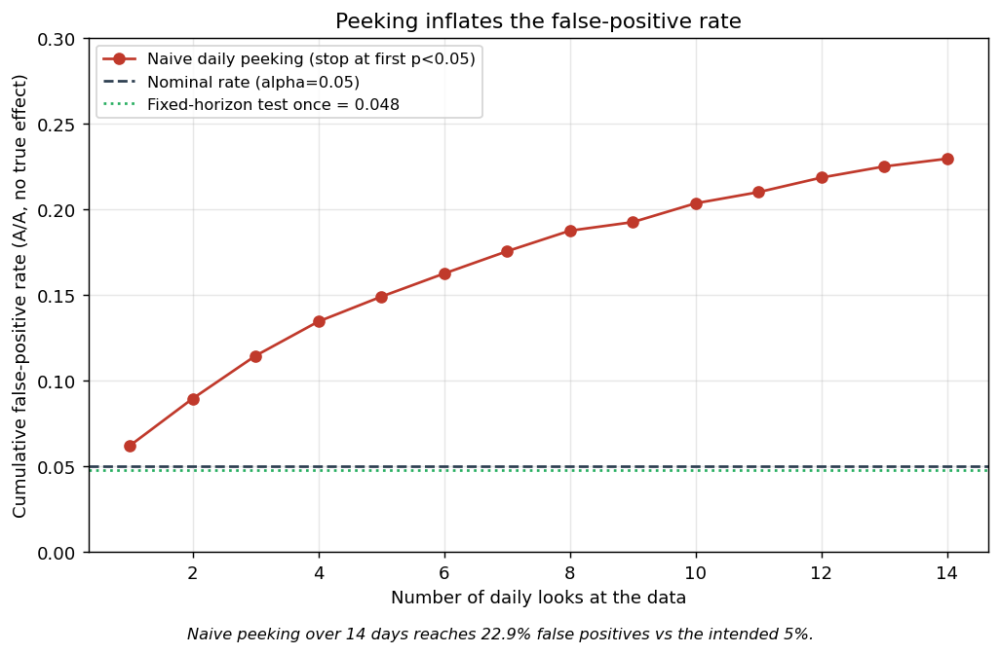
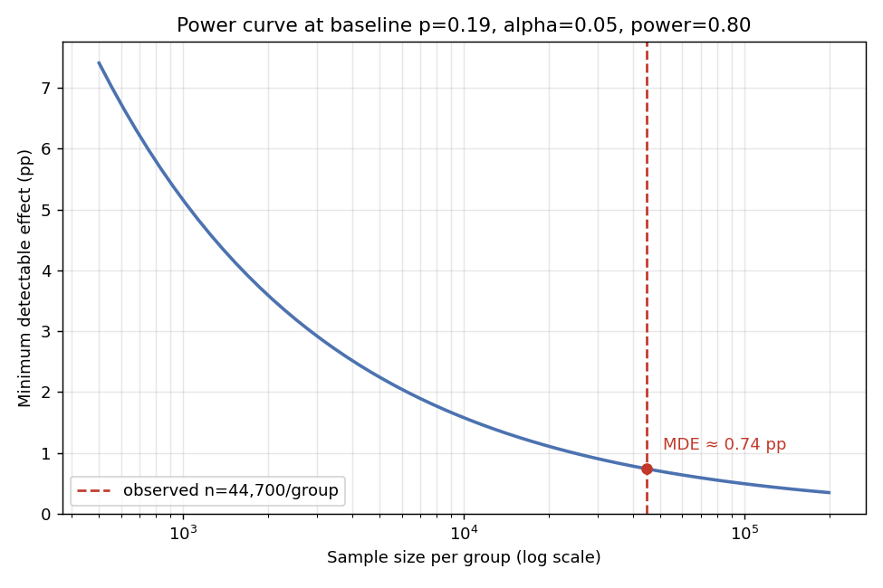

> **TL;DR** — A free-to-play game wanted to move a progression "gate" later (from level 30 to level 40) to see if it would improve retention. It didn't. Day‑1 retention was unchanged; **7‑day retention dropped 0.82 percentage points (p = 0.0016)**. The interesting part isn't the headline — it's *who* moved: the entire decline lives among the ~1 in 3 players engaged enough to actually reach the gate. **Recommendation: keep the gate at level 30.**

---

## The decision on the table

Cookie Cats is a *Candy-Crush*-style mobile puzzle game. Like most free-to-play titles, it uses **gates** — points where you either wait (sometimes a real-time delay) or pay to continue. Gates pace the experience and nudge monetization, but they're also a natural place to lose people.

The product team had a hypothesis: *the first gate at level 30 comes too early. If we let players get more invested before interrupting them — move it to level 40 — more of them will stick around.* So they ran a clean randomized experiment.

- **Control (`gate_30`):** gate stays at level 30 — 44,700 players
- **Treatment (`gate_40`):** gate moves to level 40 — 45,489 players
- **Metrics:** did the player come back on **day 1** and on **day 7**?
- **n = 90,189** players, randomized at install.

This is a great teaching dataset because the "obvious" answer (later gate = more retention) turns out to be wrong, and *why* it's wrong is a lesson in reading your users instead of your p-values.

Throughout, I report every effect as **treatment − control**, so a negative number means `gate_40` did worse.

---

## Step 1: Look at the data before you test anything

The fastest way to misread an experiment is to jump straight to the t-test. Before comparing groups, I want to understand the population.

### Engagement is brutally skewed

The median player plays **16 rounds** in their first two weeks; the mean is **52**. That gap is the signature of a long, heavy tail — a small number of extremely engaged players drag the average up. The most extreme: one player logged **49,854 rounds**, while the *next*-highest was 2,961.

That outlier is a useful gut-check. It doesn't threaten this analysis (our outcomes are binary did-they-return flags, which are immune to a single whale), but if the headline metric had been *average rounds played*, that one row would have quietly distorted everything. **Knowing which metrics your outliers can and can't poison is basic experiment hygiene.**

A second quirk: **4.4% of players logged zero rounds** — they installed and never really played. They're technically in the experiment but can't possibly be affected by a gate they'll never see. Hold that thought.

### Retention is almost entirely a function of engagement

This is the most important descriptive fact in the whole dataset. Retention isn't spread evenly — it's a near-deterministic function of how much someone plays. Players in the lowest engagement buckets almost never return; players with 200+ rounds return on day 7 **85%** of the time. The gate change, whatever it does, is operating on top of this overwhelming gradient.

### Most players never even reach the gate

Here's the punchline of the EDA, and the key to the entire result: **only ~37% of players ever reach round 30, and ~30% reach round 40.** A gate at level 30 or 40 is *invisible* to the other two-thirds of the player base. Whatever effect the treatment has, it has to come from that engaged minority — which means an experiment-wide average will dilute it. We'll see exactly that.

---

## Step 2: Is the experiment even trustworthy? (the balance check)

Before believing any result, run a **Sample Ratio Mismatch (SRM)** check. The intended split was 50/50; if the *observed* split deviates more than chance allows, something in assignment or logging is broken — and a broken randomizer can manufacture a "significant" result out of nothing. SRM is the smoke detector you check before trusting the house.

The observed split was 49.56% / 50.44%. Against the standard strict SRM threshold (α = 0.001) this **passes** (p = 0.009). Two honesty notes a good analyst flags rather than buries:

1. The split isn't razor-even — at a casual 5% threshold it would flag. SRM deliberately uses a strict α precisely because it's a tripwire you don't want firing on ordinary sampling noise at n = 90k. It passes the right test.
2. If this were my own pipeline, I'd still glance at the assignment logs once before betting a roadmap on it. Passing SRM means "no evidence of a problem," not "provably perfect."

---

## Step 3: The headline result

| Metric | Control | Treatment | Diff (t − c) | 95% CI | p-value | Verdict |
|---|---|---|---|---|---|---|
| **Day-1** | 44.82% | 44.23% | −0.59 pp | [−1.24, +0.06] | 0.074 | not significant |
| **Day-7** | 19.02% | 18.20% | **−0.82 pp** | [−1.33, −0.31] | **0.0016** | **treatment worse** |

Day-1 is a wash — the confidence interval straddles zero. Day-7 is a real, statistically significant decline. Moving the gate later made *long-term* retention worse, not better. The hypothesis was not just unsupported; it was backwards.

### Don't trust one method — triangulate

A single p-value is a fragile thing to stake a decision on. So I confirmed the day-7 result three independent ways:

**1. Frequentist z-test** — the table above. (Detail that matters: the test uses a *pooled* standard error, correct under the null of equal rates, while the confidence interval uses an *unpooled* SE, because a CI must not assume the difference is zero. Conflating those two is one of the most common A/B-testing mistakes.)

**2. Bootstrap** — resample the data 20,000 times and look at the distribution of the difference directly, with no parametric assumptions:

The entire mass of plausible outcomes sits to the *left* of zero. Treatment came out ahead in only **0.1%** of resamples.

**3. Bayesian (Beta-Binomial)** — put a posterior on each arm's true rate and ask directly: *what's the probability treatment is better?* Answer: **≈ 0.1%**. The expected cost of shipping `gate_40` is 0.82 pp of day-7 retention; the expected cost of staying put is essentially zero.

When the frequentist test, the bootstrap, and the Bayesian posterior all point the same direction, you're not looking at a coin that landed unluckily. You're looking at a real effect.

---

## Step 4: The twist — *who* actually moved

Here's where average treatment effects can mislead. A gate can only affect a player who **reaches** it, and we already know two-thirds of players never do. So I split the population at the median engagement (16 rounds) into "low" and "high" engagement and re-ran the day-7 test in each group:

| Day-7 segment | Diff (t − c) | 95% CI | p-value | |
|---|---|---|---|---|
| **Low** engagement (≤16 rounds) | −0.01 pp | [−0.30, +0.28] | 0.96 | nothing |
| **High** engagement (>16 rounds) | **−1.09 pp** | [−1.97, −0.21] | 0.015 | **significant** |

**The conclusion flips across segments.** Players who barely touch the game are completely unaffected — exactly as physics demands, since they never see the gate. The *entire* day-7 decline is concentrated among engaged players. And the per-segment effect (−1.09 pp) is larger than the diluted whole-population number (−0.82 pp), because the unaffected low-engagement half was watering it down.

This is the difference between *reporting* a result and *understanding* it. The headline "−0.82 pp, p=0.0016" is correct but flat. The segmentation tells a causal story that's coherent with the game's mechanics: **moving the gate hurt precisely the engaged players the change was supposed to help, and it did so in a way an experiment-wide average partially masked.** That coherence is, for me, the single strongest reason to trust the result — it's not just a number that cleared a threshold, it's a number that makes sense.

*(One caveat I'd never skip: the engagement split is post-hoc, and engagement is itself an outcome, not a randomized factor. So I treat this as powerful corroboration of the mechanism, not as a second independent confirmatory test.)*

---

## A practitioner's sidebar: why you can't just "check it every day"

A question that always comes up: *the result was significant — could we have stopped early and shipped (or killed) it sooner?* This is a trap, and it's worth showing why with a simulation.

I ran 2,000 **A/A** experiments — both arms drawn from the *identical* rate, so there is *no* true effect and every "significant" result is a false alarm. Then I peeked every day for two weeks and "called it" the first time p dropped below 0.05.

A single, pre-planned test holds its false-positive rate right at the intended 5% (the green line). But peeking daily and stopping at the first significant result drives the false-positive rate up to **~23%** — nearly one in four "wins" is pure noise. Each look is another lottery ticket against the null.

**The fix:** decide your sample size in advance and test once, *or* use a method built for continuous monitoring — group-sequential alpha-spending boundaries (O'Brien-Fleming / Pocock), always-valid sequential p-values (mSPRT), or a Bayesian rule with a calibrated stopping criterion. All of them spend your 5% error budget *across* the looks instead of paying it in full at every single one. The Cookie Cats analysis was run as a fixed-horizon test, so it sidesteps this entirely — but the instinct to "just watch the dashboard" is exactly how teams ship noise.

---

## Were we even powered to see this?

At ~44,700 players per arm, this experiment could reliably detect a day-7 difference of about **0.74 pp** (at 80% power, α = 0.05). The effect we found (−0.82 pp) sits just above that floor — so we were adequately, but not lavishly, powered. The flip side: −0.82 pp is a *small* effect in absolute terms. It's real and it's the wrong direction, but it's the kind of magnitude that's easy to over- or under-read without the power context. Always pair "is it significant?" with "what were we capable of detecting?"

---

## The recommendation

**Keep the gate at level 30. Do not ship `gate_40`.**

The change delivered no day-1 upside and a small-but-robust day-7 retention loss that concentrates in the most engaged players — the segment most tied to long-term value and monetization. Across three independent statistical lenses, the probability that `gate_40` is actually the better choice on day 7 is about **0.1%**.

If the team still believes later gating can help, the next test I'd run is a gate **further** out (level 50/60) or a **softer** gate mechanic, sized in advance to detect a ~0.5 pp day-7 move, and pre-registered so it's analyzed once rather than monitored into a false positive.

### What I'd caveat to stakeholders

- **One game, one 7-day window.** We don't see day-14/30 retention or revenue. A gate change could in principle trade retention for monetization; day-7 retention is the best available *proxy* for long-term value, not a guarantee of it.
- **The split is slightly uneven.** It passes the strict SRM threshold; I'd still eyeball assignment logs before a high-stakes call.
- **Segmentation is post-hoc.** Strong corroboration of the mechanism, not an independent confirmatory test.

---

## How this was built (for the curious)

The whole analysis is a small, tested Python project — `pandas / numpy / scipy / statsmodels / matplotlib`, no heavy frameworks. A few choices I'd defend in an interview:

- **The statistics live in pure, unit-tested functions.** Every test (z-test, bootstrap, power, Bayesian) is validated against known ground truth *before* it touches real data — including an A/A calibration showing the engine holds a 4.8% false-positive rate across 1,000 null experiments. If your test can't behave correctly on data with no effect, nothing it says about real data is trustworthy.
- **Triangulation over a single method**, as above.
- **Every claim in this post is reproducible** from the repo (`python src/run_analysis.py`, `python src/segmentation.py`, `python src/eda.py`).

The point of an experiment isn't to produce a p-value. It's to make a good decision and to *understand the mechanism* well enough to make the next one. Here, the significant headline was almost the least interesting thing in the data — the story was in who reached the gate.

*Dataset: [Cookie Cats A/B test on Kaggle](https://www.kaggle.com/datasets/mursideyarkin/mobile-games-ab-testing-cookie-cats).*
