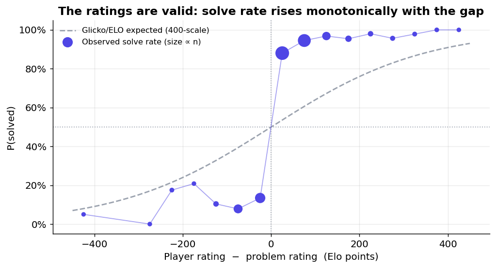
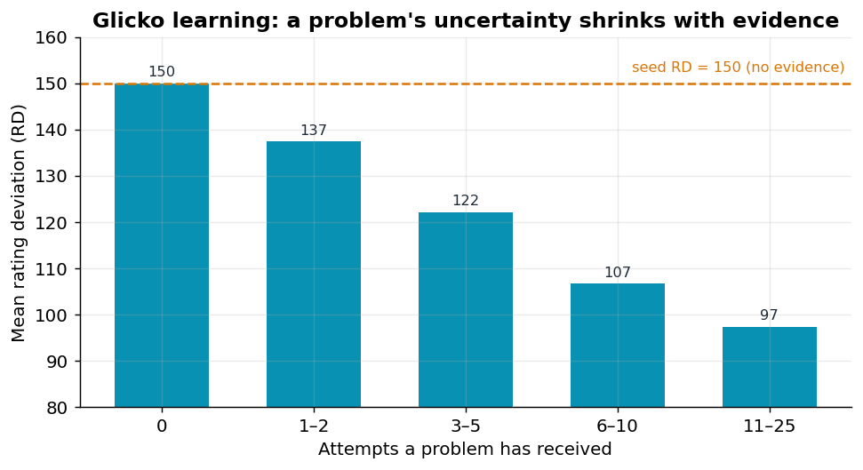
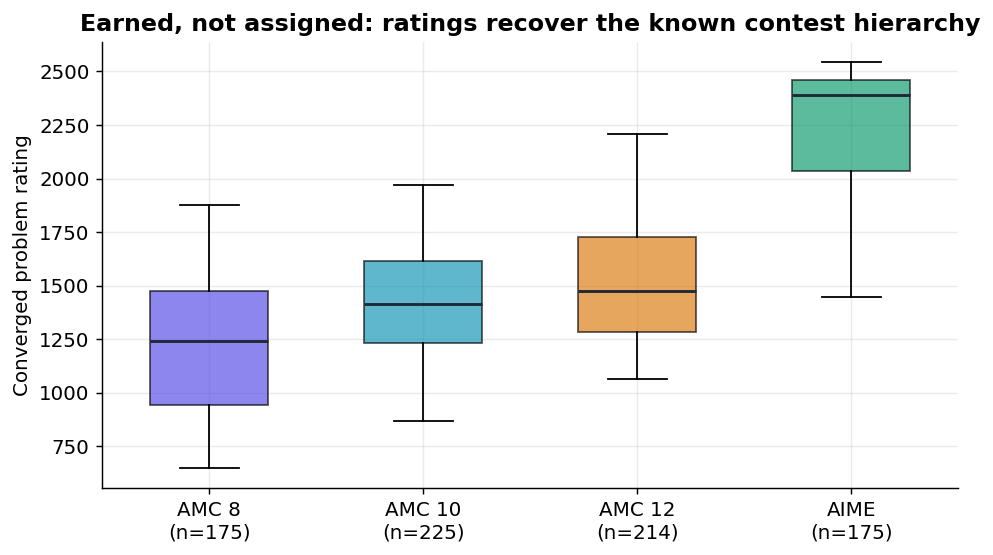
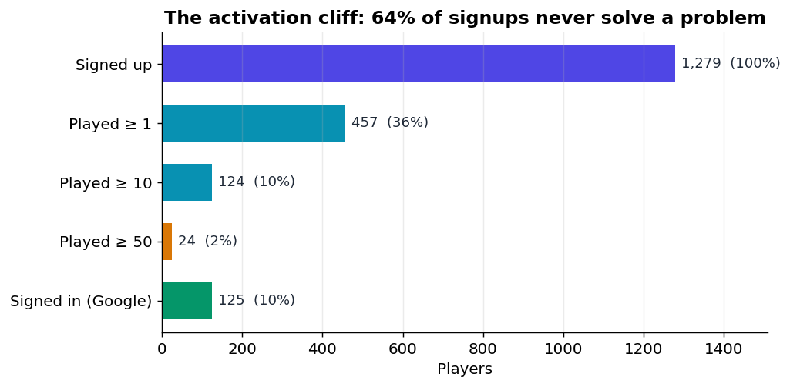
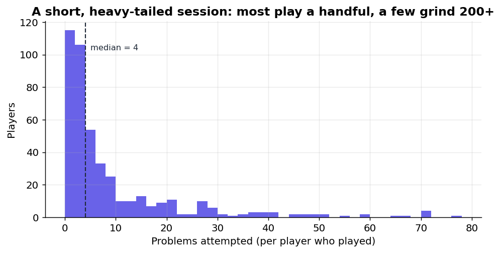
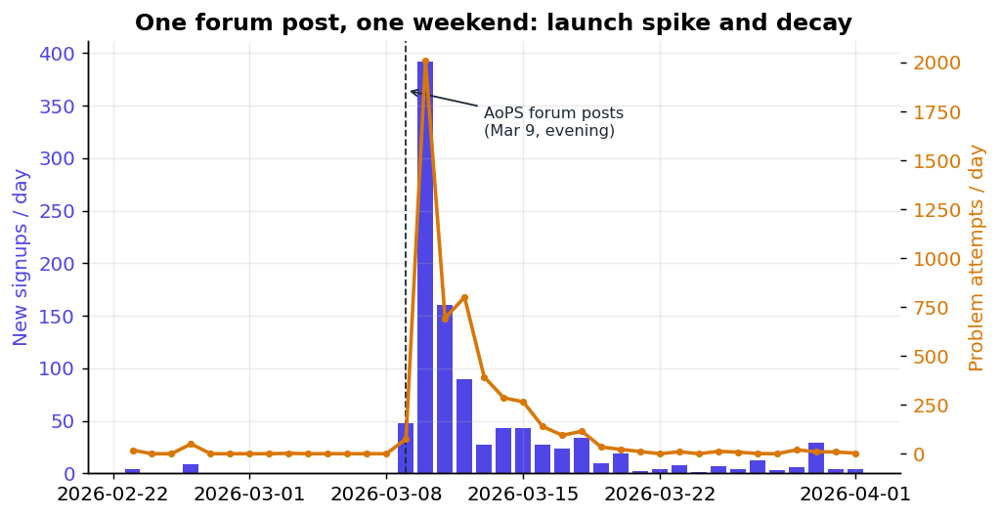

> **TL;DR:** I built [GLICKGLICK](https://glickglick.com), a math-practice site that serves each player the problem of "ideal difficulty." The underlying foundation is a two-sided unsupervised rating system which acts as a **self-calibrating recommender,** in the sense that it learns problem difficulty and student skill simultaneously. With **5,697 attempts** the ratings independently **recover the known AMC 8, AMC 10, AMC 12, AIME difficulty hierarchy**, and solve probability rises monotonically with the rating gap. One AoPS forum post drove **1,279 signups in a weekend**! Built in around 3 weeks with the aid of Claude Code.

---

## Problem statement

Trying to find ideally difficult problems is really nontrivial. Do problems that are too easy and you're wasting time; too hard and you get frustrated. The zone of desirable difficulty is a constantly moving target.

To recommend problems in that zone, two heuristics are helpful:

1. **How good is this student?**
2. **How hard is this problem?**

The naive solution is for a human to hand-label difficulty ("this is a 7/10") and guess skill from a placement quiz of sorts. I think this is stupid. Human difficulty labels are deeply subjective.

Here's the key insight: **what if we treat every solve attempt as a match between a player and a problem?** The student "wins the match" if they solve it, and the problem "wins" if the student doesn't. Now assign a rating to both sides, along with a rating system (I use Glicko-2 here). This will estimate both ratings simultaneously without the need for hand-labeling. The difficulty of a problem is defined precisely by who beats it!

The recommendation algo is similarly intuitive: **serve the unattempted problem whose rating is closest to yours** (with some caveats). That's a problem you should solve about half the time.

You may be wondering if this idea actually works. After all, theory is great in theory, but not always in practice.

---

## Rating system math

Plain **Elo** gives every player one number and nudges it after each game. The rating update is defined by

```
expected_score = 1 / (1 + 10^((R_opponent - R_you) / 400))
R_you' = R_you + K * (actual_score - expected_score)
```

It works, but it has a big weakness. It's somewhat indifferent to player experience, which is suboptimal. A rating system should have higher confidence in the accuracy of a player's rating after many games.

**Glicko-2 fixes this by carrying two more numbers per competitor:**

- **Rating Deviation (RD):** how *uncertain* we are about the rating. A new player starts at RD 350 (intuitively, "could be anywhere"), whereas a player we've seen 50 times has a smaller RD.
- **Volatility (σ):** how *erratic* the competitor's results are. Someone whose performance is wildly inconsistent gets a higher volatility, which keeps their RD from collapsing too soon.

Some finer points regarding implementation:

- **`g(φ)` discounts uncertain opponents.** Beating a player whose own rating is shaky tells you less than beating one whose rating is pinned down, so their influence on your update shrinks. `g(φ) = 1 / sqrt(1 + 3φ²/π²)`.
- **The expected score** is the same logistic shape as Elo, bent by that discount: `E = 1 / (1 + exp(-g(φ)(μ - μⱼ)))`.
- **Volatility is solved, not assigned.** Each update finds the new σ by rooting a nonlinear equation (the posterior mode of log-volatility) with the **Illinois algorithm:** a numerically stable variant of regula falsi. ([My implementation](https://github.com/sentsailing/glicko-puzzles/blob/master/src/lib/rating/glicko.ts) brackets the root, iterates to a `1e-6` tolerance, and is unit-tested against the reference paper's worked example.)

Minor caveat from my implementation: **a solve is scored from both sides.** When you submit an answer, I run the Glicko-2 update twice. Once for you with `score = 1` if correct, and once for the problem with the inverse `score = 0`. You and the problem are opponents, and you push on each other's ratings symmetrically. Solve a problem rated well above you and you jump while its difficulty ticks down; miss an easy one and it gets a little "harder" while you slip. Over thousands of attempts, this two-sided pressure is what lets difficulty emerge from play.

---

## Engineering details

**Tech stack:** Next.js 15 (App Router) on Vercel, PostgreSQL via Prisma, Firebase for auth, KaTeX for rendering the math. TypeScript throughout. Three data features are essential: `Player`, `Problem`, and `Attempt` (with the `Attempt` row storing `ratingBefore` and `ratingAfter` so every rating is auditable and the whole history is reconstructable). This is necessary for future analytics work.

**Anonymous-first auth:** friction kills funnels, so you can play instantly with no account. The server will mint a session token and create an anonymous `Player`. If you later sign in with Google, the anonymous player is migrated in place (and gains a `firebaseUid`), thus preserving rating and history.

**The recommender is pure SQL:** it would be easy to pull a few hundred problems into JS and sort them, but that doesn't scale well for thousands of problems. Instead, `selectNextProblem` is three tiers of indexed query:

1. The closest-rated unattempted problem within a ±400 window, `ORDER BY ABS(p.rating - :playerRating) LIMIT 1`, using `NOT EXISTS` against a composite `(playerId, problemId)` index (measurably ~7× faster than the `NOT IN` version I started with) and a `(excluded, rating)` index to make the window scan cheap.
2. If that window is empty, widen to the whole table.
3. Once you've exhausted every problem, fall back to a LRU queue.

The matching logic ("closest rating I haven't seen") is just one `ORDER BY`!

**Problem scraping:** There are 3,650 problems, and I did not type them in manually. A scraper pulls AMC 8/10/12 and AIME problems from the Art of Problem Solving wiki via its MediaWiki API.

- Math is stored as wiki markup (`<cmath>`, `<asy>` for Asymptote diagrams, `[[File:]]` images); the scraper converts inline/display math to KaTeX-friendly `$...$`, and flags problems whose diagrams can't be rendered properly for the recommender to exclude.

Additional correctness work: 
- Tier promotion uses **hysteresis** (your displayed tier only changes after three consecutive attempts agree, so you don't flicker at a boundary).
- Answer-checking normalizes whitespace, case, and trailing zeros with a numeric tolerance.
- Every endpoint is rate-limited.
- An admin triage queue for manually overseeing the inevitable bugs. 

---

## AI agent engineering

This was built with [Claude Code](https://claude.com/claude-code), and I think this is worth being specific about. Obviously model capabilities have increased tremendously in the last year, so it would be a mistake not to maximally leverage those capabilities.

Agents collapse the cost of doing, which leaves me as the decision-maker for factors like taste, product judgment, messaging, etc... The system design and architectural decisions (two-sided rating, SQL-native recommender, RD-150 seeding, anonymous-first auth) were made by me. Using AI simply makes it cheap to implement and verify my initial choices.

Future post coming about how I effectively increase my engineering throughput using agent harnesses!

---

## Does the recommender actually work?

This is the most interesting question, of course, and the reason I logged `ratingBefore`/`ratingAfter` on every attempt from day one. Let's test the following working thesis: **a two-sided rating system is a self-calibrating recommender**.

### Test 1: Are the ratings meaningful?

If the ratings mean anything, the probability of solving a problem should rise smoothly as your rating exceeds the problem's. Fortunately, it does!



The crossover sits right where the theory says it should: when player and problem are evenly matched, you solve about half. But the realized curve is steeper than the logistic the math assumes (the dashed line). In practice a ~100-point edge is nearly decisive, where Elo's 400-scale predicts a coin-flippy 64%. This means the ratings are sharply discriminative. (Caveat: a problem's rating here is its current value, so early attempts are measured against a difficulty that has since moved. The monotonicity is robust to this, so the exact steepness is perhaps only suggestive.)

### Test 2: Does uncertainty actually shrink with evidence?

This is the intellectual value-add of Glicko-2 instead of Elo. The answer to this question is yes:



A problem nobody has touched sits at its seed RD of 150; by 11–25 attempts, RD has compressed to ~97. We see that the system is learning difficulty from play, exactly as designed. Note that the data is sparse here. With 5,697 attempts spread over 3,650 problems, most of the catalog is still low n. This is a consequence of problems vastly outnumbering players.

### Test 3: Do the learned ratings recover ground truth?

Here's the most significant result. The system is never explicitly told that AIME is harder than AMC 8; `source` is just a label it ignores. If difficulty genuinely emerges from play, the converged ratings should reconstruct the contest hierarchy on their own:



They do! AMC 8 ≈ 1,240, AMC 10 ≈ 1,410, AMC 12 ≈ 1,470, AIME ≈ 2,390 in median, cleanly separated and correctly ordered. The same picture holds for the human EASY/MEDIUM/HARD tags (1,195 / 1,520 / 1,962).

### Even more caveats

Overall, players solve **69.8%** of the problems they're served. (In theory, this number should be much closer to 50%.) I think there's three reasons for this.

1. **Cold start lag:** new players start at 1200 with a huge RD and climb fast as they reveal their skill. While they're climbing, they're underrated, so the matched problems are below their true ability. This indicates that 1200 was too low of an initial rating.
2. **Evidence starvation:** most problems are rated from a handful of attempts (see Test 2 in the previous section).
3. **Memorization:** in the AoPS threads, top players openly noted they'd "mocked too many AIMEs" and were solving from memory. It's a fundamental limit of outcome-based ratings, and incorporating time-to-solve data into the player's rating might help here.

---

## Product analytics (consumer retention is hard)



**1,279 people signed up, 822 of them (64%) never solved a single problem, and only around 10% played ten or more.**

This is a powerful lesson in attention leakage. The product was anonymous (no sign-in required) specifically to minimize friction, and still lost most of its traffic before the first problem. Most of that was probably curiosity clicks that were never going to convert, but of some it is attributable to product design choices. 

Retention adds to the story:



Among the 457 who actually played, the median player solved **4 problems in a single sitting and never came back.** Only 23% returned on a second day. A heavy tail of grinders (max: 230 attempts) is clearly responsible for most of the volume. I think one takeaway might be this: a leaderboard is a fantastic acquisition hook and a poor retention one.

---

## GTM when the market is kids

GLICKGLICK had effectively one distribution channel.



On the evening of March 9, I posted in three [Art of Problem Solving](https://artofproblemsolving.com) community forums: the [Middle School Math](https://artofproblemsolving.com/community/u568972h3792097p37446664), [High School Math](https://artofproblemsolving.com/community/u568972h3792141p37446747), and [Contests & Programs](https://artofproblemsolving.com/community/u568972h3792161p37460632) boards, and seeded the same audience on a few competition math Discord servers.

The response was immediate: **48 signups that evening, 392 the next day, 160 the day after,** then a long decay. Roughly **800 of the 1,279 signups arrived in the first 72 hours.** AoPS is a perfect audience for this! Exactly the students who want graded AMC/AIME practice, concentrated in one place.

- Positioning wrote itself against the incumbents: AoPS users immediately benchmarked it against MathDash ("$100/month"), AMC Trivial, and various Olympiad-focused tools.
- The model's behavior leaked into the thread. Users hit the cold start lag directly (*"why am I getting AMC12 stuff and AIME at 1700?"*) and I found myself explaining convergence in real time: *"it takes like 5 games for the problem to approach its true elo."*
- Some engineering decisions got validated by accident. I'd added JSON-LD educational metadata partly so school web filters would classify the site as educational rather than as a game. The thread is full of *"it's blocked at my school"* and, tellingly, *"haha mine's green"* (allowed). For a tool whose users are students on school networks, getting categorized correctly is critical! This is such a niche subtlety but I think it shows that the factors driving growth can be unpredictable, and that you should spend time sniffing them out.

---

## Possible optimizations and future features

- **Attacking the activation cliff first.** Drop users into a problem before anything else loads and remove landing page friction.
- **Adding a timed signal** to dilute the memorization problem and give the rating system something harder to game. Also, implementing the 1v1 and timed modes users asked for, which drive further retention loops.
- **Pooling ratings across a problem's contest** as a prior, to add initial context instead of sitting at a default seed.
- **A complete GTM strategy** targeting math club administrators at middle/high schools in the US. First, I'd build web scrapers to find club administrators and math teachers. Then I'd coordinate a digital outreach campaign to promote the site, using some email sequencing tool like Apollo.

---

*Code: [github.com/sentsailing/glicko-puzzles](https://github.com/sentsailing/glicko-puzzles) · Live: [glickglick.com](https://glickglick.com). Every chart in this post is reproducible from the anonymized export in the repo (`make_charts.py` over the `data/` CSVs); the rating math lives in [`src/lib/rating/glicko.ts`](https://github.com/sentsailing/glicko-puzzles/blob/master/src/lib/rating/glicko.ts).*
